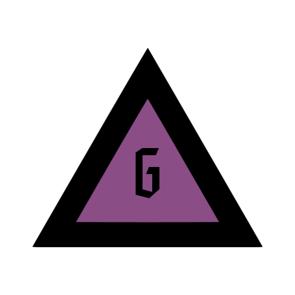
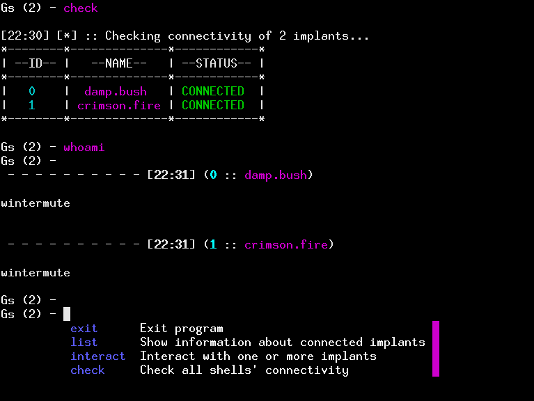

<h1 align="center"> GodSpeed </h1> 

  

     

## Introduction
GodSpeed is a robust and intuitive manager for reverse shells.

It supports tab-completion, verbose listing of connected hosts  and easy interaction with selected shells by passing their corresponding ID.

## Basic usage

When no options are used, the reverse listener is launched on port 4444 and the main prompt is started.

Listening port can be specified with `--port` flag. The full address of the listening server can be copied to clipboard with `--clip`.

From the prompt, you can list connected shells with `list` command, interact with them using `interact <id_1> ... <id_N>` and see if each connection is alive with `check` command. 

Running `check -r` will remove dead connections from the pool.

Running `interact *` will set status of every connected shell as active.

Running `interact -r <id>` sets status of selected ID as inactive (this connection will not receive entered commands).

## Requirements

     github.com/akamensky/argparse
     github.com/olekukonko/tablewriter
     github.com/atotto/clipboard
     github.com/c-bata/go-prompt
     github.com/common-nighthawk/go-figure
     github.com/fatih/color
     github.com/redcode-labs/Coldfire
     github.com/taion809/haikunator
## Screenshots

  

  

## License
This software is under [MIT License](https://en.wikipedia.org/wiki/MIT_License)